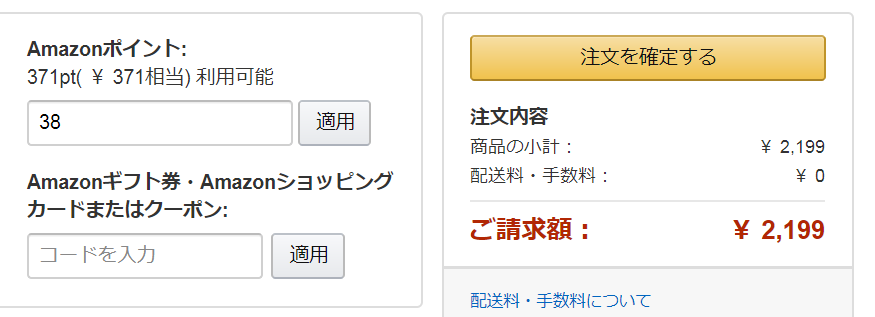

# Amazon JP Optimum Point Use
If you are using [Amazon Mastercard](https://www.amazon.co.jp/MasterCard_%E3%83%9E%E3%82%B9%E3%82%BF%E3%83%BC%E3%82%AB%E3%83%BC%E3%83%89_/b?&node=3036192051) in [amazon.co.jp](amazon.co.jp) you will get some Amazon points when you buy something. This is a script to fill the point apply form with optimum efficiency.

## Detail
Lets say you have these conditions.

|Content|Value|
|---|---|
|Total purchase price|`¥2199`|
|Point rate|`2.5%` (Amazon Mastercard Gold)|

The point you get is calculated as follows.  
```js
Math.ceil(2199 * 2.5%) = 55
// Point rate is 55 / 2199 ≈ 2.501%
```
However you can increase the point rate by adjusting the total purchase cost.
```js
Math.ceil((2199 - 38) * 2.5%) = 55
// Point rate is 55 / (2199 - 38) ≈ 2.545%
```
The script automatically does this calculation and fills the adjusted point in the form. You just need to click the apply button if you want to.

