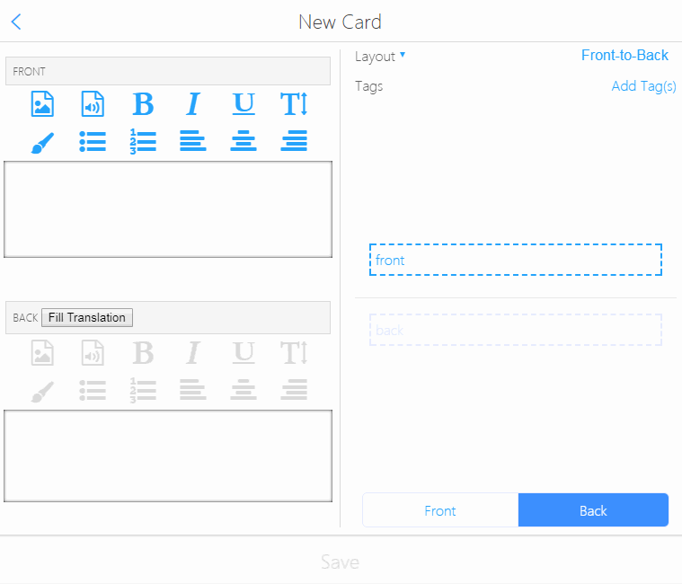

# AnkiApp Fill Translation
If you want to learn foreign languages with [AnkiApp](https://web.ankiapp.com/), you might want to create decks by yourself. This is a script to help you filling translations when you create/edit a card.

## Detail
Here is the demo of how it works.

## Precautions
This script is getting the translation data from [Weblio](https://ejje.weblio.jp/), and thus you should be careful to share the deck. Weblio could be restricting those usage.
> https://www.weblio.jp/info/terms.jsp